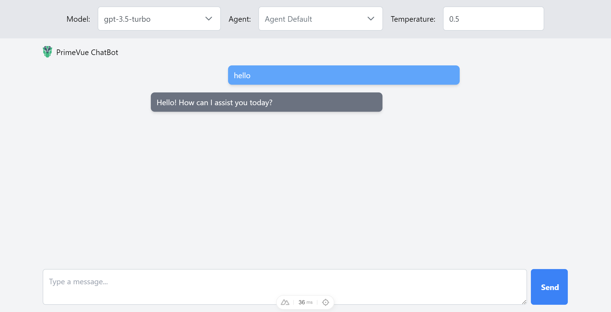

# This is an interface for using the chatgpt API

It uses PrimeVue. This is an experiment for my own benefit. Much credit to
You will need your personal OpenAi API-KEY. Get it here: https://platform.openai.com/account/api-keys

Much credit to [Slamsneider](https://github.com/Slamsneider/SimpleHtmlChatAgents) for his inspiration!



## Setup

Make sure to install the dependencies:

```bash
# yarn
yarn install
```

Add your OPENAI API KEY, PINECONE INDEX, PINECONE ENVIRONMENT, and PINECONE API KEY to the .env file

Add your PDFs to send to PINECONE in storage/pdfs directory

## Development Server

Start the development server on `http://localhost:3000`:

```bash
# yarn
yarn dev
```

## Production

Build the application for production:

```bash
# yarn
yarn build
```

Locally preview production build:

```bash
# yarn
yarn preview
```
